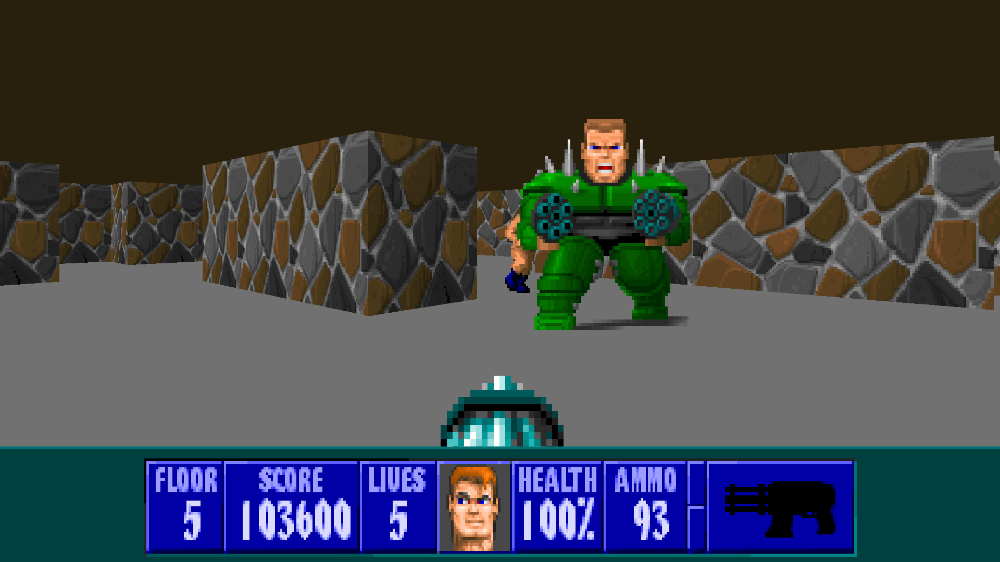

# Wolfenstein 3D (ECWolf)

### Description
ECWolf is an advanced source port for Wolfenstein 3D, Spear of Destiny, and Super 3D Noah's Ark based off of the Wolf4SDL code base.

### License
BSD|LGPL

### Icon

### Screenshots

